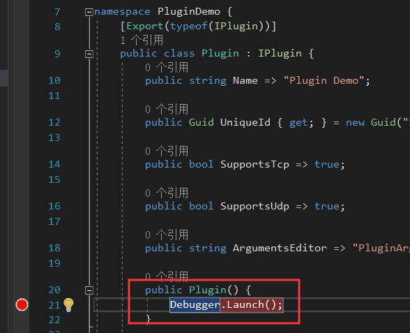

<div align="center">
<h1>Win2Socks Plugin Development Guide</h1>
<a>English</a> | <a href="./README.zh-Hans.md">简体中文</a>
</div>
<br>

[Win2Socks](https://win2socks.com/) is a transparent proxy software for Windows that allows programs, software, or games that do not support proxy setup to access the network through a proxy, supports transparent forwarding of `TCP` and `UDP` traffic.

Currently, Win2Socks has built-in support for the `SOCKS5`, `HTTPS` and `Shadowsocks` protocols. Also, custom plugins are supported so that users can simply implement custom traffic encryption or confusion.

This guide is intended to show you how to develop a plugin for Win2Socks. For more information on Win2Socks, please visit our website at https://win2socks.com.

This repository contains:

- A complete Win2Socks plugin example - **PluginDemo**
- A complete Win2Socks plugin external arguments editor example - **PluginArgumentsEditor**
- A packaged plugin zip package - `PluginDemo.zip`

<br>

## Table of Contents <!-- omit in toc -->
- [Requirements](#requirements)
- [Create Project](#create-project)
- [Implement Interfaces](#implement-interfaces)
  - [`IPlugin`](#iplugin)
  - [`IClientBuilder`](#iclientbuilder)
  - [`IPluginClient`](#ipluginclient)
  - [Complete example](#complete-example)
- [Implement Plugin Arguments Editor](#implement-plugin-arguments-editor)
- [Debug Plugin](#debug-plugin)
- [Publish Plugin](#publish-plugin)
- [Install Plugin](#install-plugin)
- [Uninstall Plugin](#uninstall-plugin)
- [Upgrade/Update Plugin](#upgradeupdate-plugin)

<br>

## Requirements

- Visual Studio 2019
- .NET Framework 4.7.2
- Win2Socks v1.4 or higher
- Familiar with C# async/await asynchronous programming pattern

<br>

## Create Project

There are two ways to create a Win2Socks plugin project:

1. [Use pre-defined plugin project templates by installing Visual Studio extensions](#create-by-project-template) (**the easiest way, recommended**).

2. [Create projects manually](#create-a-project-manually) (*more complicated and cumbersome, if not necessary, not recommended*).

    ### Create by project template 

    - #### Install the extension

        Run Visual Studio 2019, click `Extensions` -> `Manage Extensions` in the top menu, type `Win2Socks` in the search bar in the upper right corner, and in the search results you will see an extension called `Win2Socks Plugin Template`. Click `Download`, wait for the download to complete, exit Visual Studio to install the extension, and restart Visual Studio after the installation is complete.

        You can also [download](https://marketplace.visualstudio.com/items?itemName=Win2SocksSoftwareLLC.Win2SocksPluginTemplate&ssr=false) this extension directly to install it.

    - #### Create the project

        Create a new project through the menu or project creation window, and set the project template tags to `C#` `Windows` `Library`, as shown below, and use the `Win2Socks Plugin` template to create project.

        

        After the project is created, you will see the project structure shown below, in which 3 necessary class files are automatically generated.

        

        If you open one of the files to view, you will find some code errors, just build the project once to eliminate. This is because the NuGet package was not restored after the project was first generated.

        **At this point, the project has been created.** [**Skip create a project manually, read the next step.**](#implement-interfaces)
    
    ---

    ### Create a project manually

    - #### Create the project

        Create a `Class Library (.NET Framework)` project with the `Framework` selected `.NET Framework 4.7.2`. **Be careful not to create a `Class Library (.NET Standard)` or a `Class Library (.NET Core)` project by mistake.**

    - #### Install the necessary NuGet packages

        Install the following two packages into the project through the NuGet package manager (GUI or command line):

        - `Win2Socks.Plugin` [(1.0.0)](https://www.nuget.org/packages/Win2Socks.Plugin/1.0.0)
        - `System.Composition.AttributedModel` [(1.3.0)](https://www.nuget.org/packages/System.Composition.AttributedModel/1.3.0)

    - #### Add the necessary classes

        Create three classes to implement the following three interfaces (need to add `using Win2Socks.Plugin;` in the code file):

        - `IPlugin`
        - `IClientBuilder`
        - `IPluginClient`

        Add `using System.Composition;` to the file of the implementation class of `IPlugin` and add the `[Export(typeof(IPlugin))]` attribute to the class, as follows:

        ```cs
        using System;
        using System.Composition;
        using Win2Socks.Plugin;

        namespace MyWin2SocksPlugin 
        {
            [Export(typeof(IPlugin))]
            public class Plugin : IPlugin 
            {
                ...
            }
        }
        ```

        **At this point, the manual creation of the project has been completed.**

    <br>

## Implement Interfaces

Each Win2Socks plugin needs to implement 3 necessary interfaces:

- [`IPlugin`](#IPlugin)

    Used to provide the main information of the plugin, as well as parse the plugin arguments string and create `IClientBuilder`.

- [`IClientBuilder`](#IClientBuilder)

    Used to cache parsed plugin arguments and create `IPluginClient`. Each `IClientBuilder` corresponds to a plugin server in the Win2Socks proxy server list.

- [`IPluginClient`](#IPluginClient)

    The main logic used to implement traffic encryption, obfuscation, and data transmission and reception.

### `IPlugin`

#### Properties <!-- omit in toc -->

| Name | Remarks |
| ---  | --- |
| `Name` | The custom plugin name will be displayed on the Win2Socks user interface. |
| `UniqueId` | A GUID that identifies the uniqueness of the plugin. <br><br> If it is a project created from project template, a GUID is automatically generated and does not need to be changed; <br> If you are creating a project manually, you will need to specify a unique GUID. <br><br> When you update your plugin to a newer version, use the same GUID as the old one. |
| `SupportsTcp` | Indicates whether the plugin supports handling `TCP` traffic. <br><br> This will determine whether the `TCP` protocol can be checked on the **Win2Socks Rule Details Window** and whether the plugin can be used for **Web Mode**. |
| `SupportsUdp` | Indicates whether the plugin supports handling `UDP` traffic. <br><br> This will determine whether the `UDP` protocol can be checked on the **Win2Socks Rule Details Window** and whether the plugin can be used for **Remote DNS**. |
| `ArgumentsEditor` | The file name or relative path of the plugin arguments editor, usually the editor and the plugin DLL are in the same directory, so fill in the file name with the suffix like this: `xxx.exe`. <br><br> The plugin arguments editor is used to provide a better user experience and to prevent users from manually entering plugin arguments. <br><br> If the editor is not implemented, it should return `null` directly, **instead of** throwing an `NotImplementedException` exception. |

#### Methods <!-- omit in toc -->

- `IClientBuilder CreateClientBuilder(string arguments)` <a id="iplugin-createclientbuilder"></a>

    | Parameters | Remarks |
    | --- | --- |
    | `arguments` | Plugin arguments entered by the user in the **Win2Socks Server Information Window**. <br><br>  | 

    This method is used to parse the plugin arguments entered by the user in the Win2Socks Server Information Window. An instance of the class that implements the `IClientBuilder` interface should be created in this method, the parsed arguments are stored in the instance, and the instance is returned. If the format of the arguments string is incorrect, an `ArgumentException` exception should be thrown.

    The simple implementation code is as follows (for a complete example, see the `PluginDemo` project's `Plugin.cs` file):

    ```cs
    public IClientBuilder CreateClientBuilder(string arguments) 
    {
        Dictionary<string, object> parsedArgs = // ... Parse the arguments

        object arg1 = parsedArgs["xxx"];

        if (arg1 == null)
            throw new ArgumentException(nameof(arguments));

        return new ClientBuilder(arg1, arg2, ...);
    }
    ```

    This method will be called in the following three cases:
    - when Win2Socks initializes the proxy server after startup
    - when the user adds a new server with the proxy type `Plugin` and clicks **Save**
    - when the user edits a server with proxy type `Plugin` and clicks **Save**

---

### `IClientBuilder`

#### Methods <!-- omit in toc -->

- `IPluginClient Build(IPEndPoint proxyServer, ClientProtocolType protocolType)`

    | Parameters | Remarks |
    | --- | --- |
    | `proxyServer` | The address and port of the proxy server filled in by the user in the Server Information Window. If the user fills in the domain name (for example: example.com), `proxyServer.Address` is the DNS-resolved IP address. <br><br>  |
    | `protocolType` | Indicates whether the traffic passed to `IPluginClient` is `TCP` or `UDP`. |

    The implementation of this method in the sample project `PluginDemo` is very simple, just create a `PluginClient` instance with the **server address port**, the **protocol type of the traffic** and the **resolved plugin arguments** (`PluginClient` implements the `IPluginClient` interface):

    ```cs
    public class ClientBuilder : IClientBuilder 
    {
        private readonly Algorithm _algorithm;
        private readonly byte _key;

        internal ClientBuilder(Algorithm algorithm, byte key) 
        {
            _algorithm = algorithm;
            _key = key;
        }

        public IPluginClient Build(IPEndPoint proxyServer, ClientProtocolType protocolType) 
        {
            return new PluginClient(proxyServer, protocolType, _algorithm, _key);
        }
    }
    ```

    This method will be called whenever there is a new `TCP` connection or a new `UDP` session. Since this method will be called frequently, plugin arguments should not be parsed in this method for performance reasons. Plugin arguments should be parsed in [`IPlugin.CreateClientBuilder`](#iplugin-createclientbuilder).

    > The `UDP` session consists of 4-tuple: proxy server address + proxy server port + local source address family (IPv4 or IPv6) + local source port <a id="udp-session"></a>

    The idle timeout for each `UDP` session is 1 minute, which means that the session ends when there is no data to send or receive in 1 minute.

    In most cases you don't have to worry about the `NAT` problem, Win2Socks internally implements `Full Cone`.

---

### `IPluginClient`

Each `IPluginClient` will be used to handle a separate `TCP` connection or [`UDP` session](#udp-session).

Usually the constructor of the class that implements this interface is very simple. It is important to note that you need to create the `Socket` instance (in this case, `TcpClient` and `UdpClient`) for the communication in the constructor. The implementation of `PluginDemo` is as follows:

```cs
internal PluginClient(IPEndPoint proxyServer, ClientProtocolType type, 
                      Algorithm algorithm, byte key) 
{
    _proxyServer = proxyServer;
    _type = type;

    switch (type) {
        case ClientProtocolType.Tcp:
            _tcpClient = new TcpClient(proxyServer.AddressFamily);
            break;
        case ClientProtocolType.Udp:
            _udpClient = new UdpClient(proxyServer.AddressFamily);
            break;
        default:
            throw new NotImplementedException();
    }

    _algorithm = algorithm;
    _key = key;
}
```

#### Properties <!-- omit in toc -->

| Name | Remarks |
| ---  | --- |
| `UnderlyingSocket` | The `System.Net.Sockets.Socket` instance used by the underlying communication. Usually the `Client` property of the `System.Net.Sockets.TcpClient` instance or the `Client` property of the `System.Net.Sockets.UdpClient` instance. <br><br> This property will be called before `ConnectAsync(IPAddress, int)` or `ConnectAsync(string, int)` is called, so you need to create the `Socket` that used for communication in the `PluginClient` constructor. |

#### Methods <!-- omit in toc -->

- `Task ConnectAsync(IPAddress address, int port)`

    | Parameters | Remarks |
    | --- | --- |
    | `address` | The real destination address. Usually needs to inform the proxy server of this address. |
    | `port` | The real destination port. Usually needs to inform the proxy server of this port. |

    This method will be called whenever there is a new `TCP` connection or a `UDP` session. You need to connect to the proxy server in this method, and if necessary, the handshake needs to be implemented here (for example, like `SOCKS5`). It is also usually necessary to tell the server the real destination address and port.
    
    <br>

- `Task ConnectAsync(string host, int port)`

    | Parameters | Remarks |
    | --- | --- |
    | `host` | The domain of the destination website. Usually needs to inform the proxy server of the domain. |
    | `port` | The port of the destination website. Usually needs to inform the proxy server of this port. |

    This method only applies to requests for **Web Mode**, which is only called when **Web Mode** is enabled and a request with a PAC match occurs. You need to connect to the proxy server in this method, and if necessary, you need to implement the handshake (for example, the `CONNECT` method of the HTTP tunnel). It is also usually necessary to inform the server of the destination website domain and port. 

    <br>

- `Task WriteAsync(byte[] buffer, int offset, int count)` <a id="ipluginclient-writeasync"></a>

    | Parameters | Remarks |
    | --- | --- |
    | `buffer` | A buffer containing the data that needs to be sent. |
    | `offset` | The offset in `buffer` of the data to be sent. |
    | `count` | The number of bytes of data that need to be sent. |

    This method will be called whenever there is `TCP` data sent. You should implement data encryption or obfuscation logic in this method.

    This method is a hot path (which will be called frequently). Therefore, if not necessary, **should not** allocate buffers in this method, you should allocate buffers dedicated to `write` operations in class member variables.

    Only one thread calls this method at a time, and there is usually no need to do multi-thread synchronization (such as lock) for this method. However, **it should be noted that** the `read` operation ([`ReadAsync(byte[], int, int)`](#ipluginclient-readasync)) is called by another thread, so the buffer for the `write` operation **should not** be used for the `read` operation. Instead, the separate read buffer should be used for the `read` operation; unless you implement multithreaded synchronization yourself, but this usually reduces read and write performance.

    <br>

- `Task<int> ReadAsync(byte[] buffer, int offset, int count)` <a id="ipluginclient-readasync"></a>

    | Parameters | Remarks |
    | --- | --- |
    | `buffer` | A buffer used to store decrypted or deconfused data. |
    | `offset` | Indicates the offset to write data to `buffer`. |
    | `count` | The number of bytes of data actually written to `buffer`. |

    Win2Socks calls this method in a loop. You should receive `TCP` data within this method via the previously created `Socket` instance (usually get `NetworkStream` via `TcpClient.GetStream` and then call `NetworkStream.ReadAsync`), then decrypt or deobfuscate the data, and copy the decrypted or deobfuscated data into `buffer`. 

    This method is a hot path (which will be called frequently). Therefore, if not necessary, **should not** allocate buffers in this method, you should allocate a buffer dedicated to the `read` operation in the class member variables.

    Similar to [`WriteAsync(byte[], int, int)`](#ipluginclient-writeasync), only one thread calls this method at a time. A separate buffer should be allocated for the `read` operation, and **do not** `read` `write` to same buffer.

    ##### Returns

    The number of bytes of data actually written to `buffer`.

    <br>

- `Task<int> SendAsync(byte[] datagram, IPAddress address, int port)` <a id="ipluginclient-sendasync"></a>

    | Parameters | Remarks |
    | --- | --- |
    | `datagram` | The `UDP` datagram to be sent. |
    | `address` | The real destination address. Usually needs to inform the proxy server of this address. |
    | `port` | The real destination port. Usually needs to inform the proxy server of this port. |

    This method will be called whenever there is `UDP` data sent. You should implement logic for encrypting or confusing `UDP` datagrams in this method.

    Since `UDP` is a connectionless protocol and for performance reasons, Win2Socks does not synchronize the `send` operation of the `UDP` session. Therefore, this method may be called by multiple threads at the same time. If you need to access shared resources (usually member variables of a class) in this method, you need to implement multi-thread synchronization. The usual choice is to use `lock` or use the thread-safe collection class under the [`System.Collections.Concurrent`](https://docs.microsoft.com/en-us/dotnet/api/system.collections.concurrent?view=netframework-4.7.2) namespace.

    If you use `lock` to synchronize:

    - **Not recommended** to use `lock (xxx) { ... }` statement, because it does not support the use of the `await` keyword within the block, which will lose the advantage of using the asynchronous pattern.

    - **Recommended** to use the [`SemaphoreSlim`](https://docs.microsoft.com/en-us/dotnet/api/system.threading.semaphoreslim?view=netframework-4.7.2) class as an asynchronous replacement for `lock`, but this class is not specifically designed as an asynchronous lock, so it may not be convenient to use.

    - **Recommended** to use the `AsyncLock` class of the NuGet package [`Nito.AsyncEx`](https://www.nuget.org/packages/Nito.AsyncEx/), which is specifically designed as an asynchronous lock and is easy to use. See: https://github.com/StephenCleary/AsyncEx

    ##### Returns

    The number of bytes actually sent, usually the return value of `UdpClient.SendAsync`.

    <br>

- `Task<UdpReceiveResult> ReceiveAsync()` <a id="ipluginclient-receiveasync"></a>

    Win2Socks calls this method in a loop. You should receive `UDP` datagrams within this method via the previously created `Socket` instance (usually via the `UdpClient.ReceiveAsync` method), then decrypt or deobfuscate the datagram. Usually the proxy server will include the address and port of the real remote server in the datagram, extract the address and port and the real data, and wrap it into a `UdpReceiveResult` object as the return value.

    Only one thread calls this method at a time, and usually there is no need to implement multi-thread synchronization for this method. Similar to [`WriteAsync`](#ipluginclient-writeasync)/[`ReadAsync`](#ipluginclient-readasync), [`SendAsync`](#ipluginclient-sendasync)/[`ReceiveAsync`](#ipluginclient-receiveasync) are called by different threads respectively, if you want to access shared resources (such as member variables of the class), you need to implement multi-thread synchronization.

    ##### Returns

    A `UdpReceiveResult` object.

### Complete example

The project `PluginDemo` is a complete example of implementing a simple plugin. You can refer to this project for plugin development.

<br>

## Implement Plugin Arguments Editor

The plugin arguments editor sample project `PluginArgumentsEditor` is very simple to implement, with only 50 lines of code.

It should be noted:

- You can get command line arguments by `Environment.GetCommandLineArgs()`, which contains the plugin arguments string that the user has entered. You can parse this string and then sync it to the editor's interface.

- Before the editor window is closed or the editor program exits, the arguments selected by the user through the editor should be converted to a string and copied to the system clipboard. Win2Socks will monitor the editor process and will read the contents of the clipboard as arguments string once the process exits. The effect is shown below:

    

You can develop plugin arguments editor using any language or UI framework you like.

<br>

## Debug Plugin

The development process of the plugin is inseparable from debugging. You need to create a temporary folder in the Win2Socks `Plugins` directory to store the plugin's `dll` file(s). The `Plugins` directory is located at: `..\Win2Socks\Plugins\`. 

The directory structure should look like this:

```
Win2Socks installation directory
└── Plugins
    └── MyPlugin // The folder you created manually, can be named at will.
        ├── YourPluginDll.dll
        ├── Other dlls the plugin depends on (if any)
        └── PluginArgumentsEditor.exe
```

After building the plugin project, copy the necessary files to the temporary folder above, then run Win2Socks, which will load the plugin, via the `Visual Studio` menu `Debug` -> `Attach to Process` -> select the Win2Socks process to debug the plugin.

> Note that since Win2Socks requires administrator privileges to run, `Visual Studio` also requires administrator privileges to properly attach to the process.

You can also use the `XCOPY` command in `Post-build event command line` to copy the project output file(s) to your temporary plugin folder, which avoids the hassle of manual copying each time. For example:

```bash
XCOPY $(TargetDir)*.dll "D:\Win2Socks\Plugins\MyPlugin" /Y
```

Win2Socks loads the plugin and creates the `IPlugin` instance at startup. When you want to debug the `Plugin` constructor or the [`CreateClientBuilder`](#iplugin-createclientbuilder) method, you may not have enough time to manually attach to the process. You can call `Debugger.Launch()` in the constructor of `Plugin` and add a breakpoint:

<br>

Thus, when starting Win2Socks, the debugger of `Visual Studio` will pop up asking if you want to debug, select `Yes`:

<br>

Then select the `Visual Studio` instance that already open your plugin project:

> If `Visual Studio` is not running with administrator privileges, you may not be able to select the `Visual Studio` process that has the plugin project open.

<br>

At this point, `Visual Studio` will successfully attach to the process and break at the breakpoint. This method is also suitable for debugging [plugin arguments editor](#implement-plugin-arguments-editor).
> Don't forget to delete or comment the `Debugger.Launch()` after the plugin development is complete.

<br>

## Publish Plugin

Package the `dll` file(s) required by the plugin and the `exe` file of the [plugin arguments editor](#implement-plugin-arguments-editor) (if any) into the `zip` archive to be published to the user.

There is no need to package `Win2Socks.Plugin.dll` and `System.Composition.AttributedModel.dll`, Win2Socks itself contains these two files.

> Make sure the plugin's `dll` file(s) is in the top directory of the zip archive, otherwise Win2Socks will not be able to load the plugin. Refer to the `PluginDemo.zip` file in this repository.

<br>

## Install Plugin

Select the `Plugins` view of Win2Socks, click the `Install Plugins...` button, select the packaged plugin zip file, and restart Win2Socks.

<br>

## Uninstall Plugin

Select the `Plugins` view of Win2Socks, click the `Uninstall` button of the corresponding plugin, and restart Win2Socks.

<br>

## Upgrade/Update Plugin

Similar to [Install Plugin](#install-plugin), choose to override when prompted to overwrite.