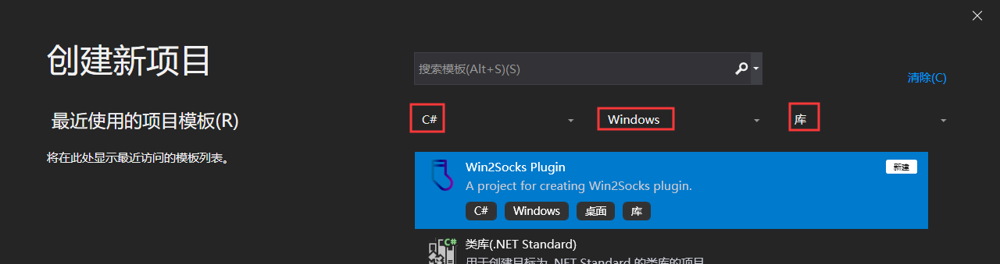
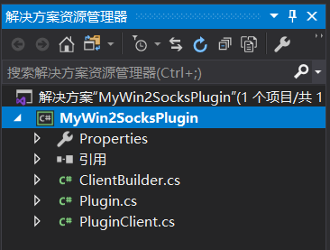
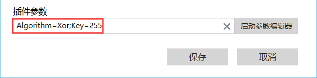
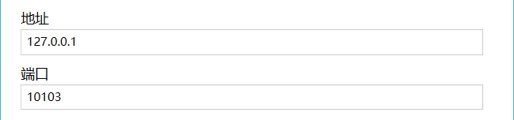
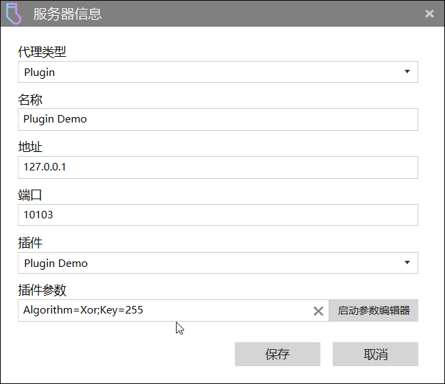
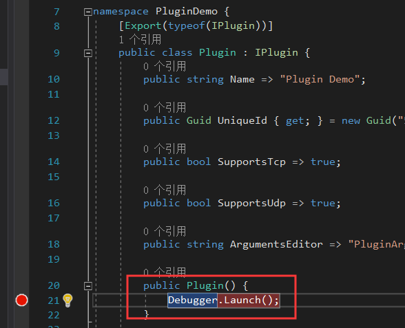
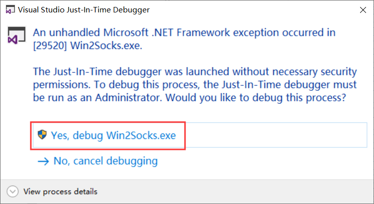
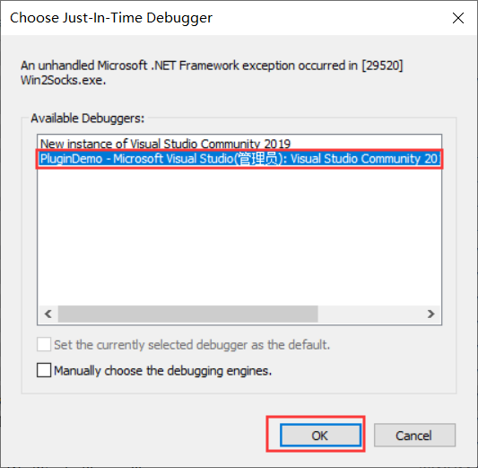

<div align="center">
<h1>Win2Socks 插件开发指南</h1>
<a href="./README.md">English</a> | <a>简体中文</a>
</div>
<br>

[Win2Socks](https://win2socks.com/) 是一款适用于 Windows 的透明代理软件，可以使原本不支持设置代理的程序、软件或游戏通过代理访问网络，支持透明转发 `TCP` 和 `UDP` 流量。

目前，Win2Socks 内置支持 `SOCKS5`，`HTTPS` 和 `Shadowsocks` 协议。同时，支持自定义插件，以便于用户可以简单地实施自定义的流量加密或混淆。

本指南旨在说明如何开发用于 Win2Socks 的插件程序，关于 Win2Socks 的更多信息请参阅我们的网站：https://win2socks.com 。

本储存库包含：

- 一个完整的 Win2Socks 插件示例 —— **PluginDemo**
- 一个完整的 Win2Socks 插件外置参数编辑器示例 —— **PluginArgumentsEditor**
- 一个打包好的插件压缩包 —— `PluginDemo.zip`

<br>

## 目录 <!-- omit in toc -->
- [必要条件](#必要条件)
- [创建项目](#创建项目)
- [实现接口](#实现接口)
  - [`IPlugin`](#iplugin)
  - [`IClientBuilder`](#iclientbuilder)
  - [`IPluginClient`](#ipluginclient)
  - [完整示例](#完整示例)
- [实现插件参数编辑器](#实现插件参数编辑器)
- [调试插件](#调试插件)
- [发布插件](#发布插件)
- [安装插件](#安装插件)
- [卸载插件](#卸载插件)
- [升级/更新插件](#升级更新插件)

<br>

## 必要条件

- Visual Studio 2019
- .NET Framework 4.7.2
- Win2Socks v1.4 或 更高版本
- 熟悉 C# 的 async/await 异步编程模式

<br>

## 创建项目

创建一个 Win2Socks 插件项目有两种方式：

1. [通过安装 Visual Studio 扩展，使用预定义的插件项目模板](#通过项目模板创建项目)（**最简单的方式，推荐**）。

2. [手动创建项目](#手动创建项目)（*较为复杂繁琐，如非必要，不推荐*）。

    ### 通过项目模板创建项目

    - #### 安装扩展

        运行 Visual Studio 2019，点击顶部菜单的 `扩展` -> `管理扩展`，在弹出的 `管理扩展` 窗口的右上角搜索栏输入 `Win2Socks`，在搜索结果中你将会看到一个名为 `Win2Socks Plugin Template` 的扩展，点击 `下载`，等待下载完成后，退出 Visual Studio 以安装扩展，安装完成后即可重新启动 Visual Studio。

        你也可以直接 [下载](https://marketplace.visualstudio.com/items?itemName=Win2SocksSoftwareLLC.Win2SocksPluginTemplate&ssr=false) 此扩展程序进行安装。

    - #### 创建项目

        通过菜单或项目创建界面创建一个新项目，将项目模板标签分别设置为 `C#` `Windows` `库`，如下图所示，使用 `Win2Socks Plugin` 模板创建项目。
        
                

        项目创建后你将会看到如下图所示的项目结构，其中已自动生成 3 个必要的类文件。

        

        如果你打开其中一个文件查看，会发现有代码错误提示，只需编译一次项目即可消除。这是因为项目首次生成后，NuGet 包并未还原造成的。
        
        **至此，项目已创建完成。**[**跳过手动创建项目的步骤，查看下一步。**](#实现接口)

    ---

    ### 手动创建项目

    - #### 创建项目

        创建一个 `类库(.NET Framework)` 项目，目标框架选择 `.NET Framework 4.7.2`。**注意，不要错误地创建了 `类库(.NET Standard)` 或 `类库(.NET Core)` 项目**。

    - #### 安装必要的 NuGet 包

        通过 NuGet 包管理器（图形或命令行）将以下两个包安装到项目：

        - `Win2Socks.Plugin` [(1.0.0)](https://www.nuget.org/packages/Win2Socks.Plugin/1.0.0)
        - `System.Composition.AttributedModel` [(1.3.0)](https://www.nuget.org/packages/System.Composition.AttributedModel/1.3.0)

    - #### 添加必要的类

        创建三个类，分别实现以下三个接口（需要在代码文件中添加 `using Win2Socks.Plugin;`）：

        - `IPlugin`
        - `IClientBuilder`
        - `IPluginClient`

        在 `IPlugin` 的实现类的文件中添加 `using System.Composition;`，并为该类添加 `[Export(typeof(IPlugin))]` 特性，如下：

        ```cs
        using System;
        using System.Composition;
        using Win2Socks.Plugin;

        namespace MyWin2SocksPlugin 
        {
            [Export(typeof(IPlugin))]
            public class Plugin : IPlugin 
            {
                ...
            }
        }
        ```

        **至此，已完成手动创建项目的步骤。**

        <br>

## 实现接口

每个 Win2Socks 插件需要实现 3 个必要的接口：

- [`IPlugin`](#IPlugin)
  
    用于提供插件的主要信息，以及解析插件参数字符串并创建 `IClientBuilder`。

- [`IClientBuilder`](#IClientBuilder)

    用于缓存解析后的插件参数，以及创建 `IPluginClient`。每个 `IClientBuilder` 对应一个 Win2Socks 代理服务器列表中的插件服务器。

- [`IPluginClient`](#IPluginClient)

    用于实现流量加密、混淆以及数据发送和接收的主要逻辑。

### `IPlugin`

#### 属性 <!-- omit in toc -->

| 属性名 | 注解 |
| ---  | --- |
| `Name` | 自定义的插件名称，将在 Win2Socks 界面上显示。 |
| `UniqueId` | 标识插件唯一性的 GUID。<br><br> 如果是通过模板创建的项目，则已自动生成一个 GUID，无需更改；<br> 如果是手动创建的项目，则需要指定一个唯一的 GUID。<br><br> 当你更新你的插件到新版本时，请使用与旧版本相同的 GUID。 |
| `SupportsTcp` | 指示该插件是否支持处理 `TCP` 流量。<br><br> 这将决定在 **Win2Socks 规则详情界面** 上能否勾选 `TCP` 协议，以及影响该插件能否用于 **网页模式**。 |
| `SupportsUdp` | 指示该插件是否支持处理 `UDP` 流量。<br><br> 这将决定在 **Win2Socks 规则详情界面** 上能否勾选 `UDP` 协议，以及影响该插件能否用于 **远程 DNS**。 |
| `ArgumentsEditor` | [插件参数编辑器](#实现插件参数编辑器) 的文件名或相对路径，通常编辑器与插件 DLL 在同一目录下，所以填写文件名包含后缀即可：`xxx.exe`。<br><br> 插件参数编辑器用于提供更好的用户体验，避免用户手动输入插件参数。<br><br> 如果没有实现编辑器，应该直接返回 `null`，**而不是** 抛出未实现异常 `throw new NotImplementedException()`。 |

#### 方法 <!-- omit in toc -->

- `IClientBuilder CreateClientBuilder(string arguments)` <a id="iplugin-createclientbuilder"></a>
  
    | 参数 | 注解 |
    | --- | --- |
    | `arguments` | Win2Socks 服务器信息编辑窗口中用户输入的插件参数。 <br><br>  | 

    此方法用于解析 Win2Socks 服务器信息编辑窗口中用户输入的插件参数。应该在此方法中创建一个实现了 `IClientBuilder` 接口的类的实例，将解析后的参数储存到该实例中，并返回该实例。如果参数字符串的格式不正确，应该抛出一个 `ArgumentException` 异常。
    
    简略的实现代码如下（完整的样例请查看 `PluginDemo` 项目的 `Plugin.cs` 文件）：

    ```cs
    public IClientBuilder CreateClientBuilder(string arguments) 
    {
        Dictionary<string, object> parsedArgs = // ... Parse the arguments

        object arg1 = parsedArgs["xxx"];

        if (arg1 == null)
            throw new ArgumentException(nameof(arguments));

        return new ClientBuilder(arg1, arg2, ...);
    }
    ```

    此方法会在以下三种情况下被调用：
    - Win2Socks 启动后初始化代理服务器时
    - 用户添加一个新的代理类型为 `Plugin` 的服务器并点击 **保存** 时
    - 用户编辑一个代理类型为 `Plugin` 的服务器并点击 **保存** 时

---

### `IClientBuilder`

#### 方法 <!-- omit in toc -->

- `IPluginClient Build(IPEndPoint proxyServer, ClientProtocolType protocolType)`

    | 参数 | 注解 |
    | --- | --- |
    | `proxyServer` | 用户在服务器信息窗口中填写的代理服务器的地址和端口，如果用户填写的是域名（例如：example.com），`proxyServer.Address` 则是经过 DNS 解析后的 IP 地址。 <br><br>  |
    | `protocolType` | 指示稍后传递给 `IPluginClient` 的流量是 `TCP` 还是 `UDP`。 |

    在示例项目 `PluginDemo` 中此方法的实现非常简单，只是用 **服务器地址端口**、**流量的协议类型** 和 **已解析的插件参数** 创建一个 `PluginClient` 实例（`PluginClient` 实现了 `IPluginClient` 接口）：

    ```cs
    public class ClientBuilder : IClientBuilder 
    {
        private readonly Algorithm _algorithm;
        private readonly byte _key;

        internal ClientBuilder(Algorithm algorithm, byte key) 
        {
            _algorithm = algorithm;
            _key = key;
        }

        public IPluginClient Build(IPEndPoint proxyServer, ClientProtocolType protocolType) 
        {
            return new PluginClient(proxyServer, protocolType, _algorithm, _key);
        }
    }
    ```

    每当有新的 `TCP` 连接 或者 新的 `UDP` 会话时，此方法将被调用。由于此方法会被频繁调用，出于性能考虑，不应该在此方法中解析插件参数，应该在 [`IPlugin.CreateClientBuilder`](#iplugin-createclientbuilder) 中解析插件参数。

    > `UDP` 会话由 4 元组组成：代理服务器地址 + 代理服务器端口 + 本地源地址族（IPv4 或 IPv6） + 本地源端口 <a id="udp-session"></a>

    每个 `UDP` 会话的空闲超时为 1 分钟，即 1 分钟内该会话没有数据发送或接收时结束会话。

    大部分情况下你无需考虑 `NAT` 问题，Win2Socks 内部实现了 `Full Cone`。

---    

### `IPluginClient`

每个 `IPluginClient` 将用于处理一个独立的 `TCP` 连接 或 [`UDP` 会话](#udp-session)。

通常实现此接口的类的构造函数非常简单，需要特别说明的是，你需要在构造函数就创建好通信所用的 `Socket` 实例（本例中是 `TcpClient` 和 `UdpClient`），示例项目 `PluginDemo` 的实现如下：

```cs
internal PluginClient(IPEndPoint proxyServer, ClientProtocolType type, 
                      Algorithm algorithm, byte key) 
{
    _proxyServer = proxyServer;
    _type = type;

    switch (type) {
        case ClientProtocolType.Tcp:
            _tcpClient = new TcpClient(proxyServer.AddressFamily);
            break;
        case ClientProtocolType.Udp:
            _udpClient = new UdpClient(proxyServer.AddressFamily);
            break;
        default:
            throw new NotImplementedException();
    }

    _algorithm = algorithm;
    _key = key;
}
```

#### 属性 <!-- omit in toc -->

| 属性名 | 注解 |
| ---  | ---- |
| `UnderlyingSocket` | 底层通信所使用的 `System.Net.Sockets.Socket` 实例，通常是 `System.Net.Sockets.TcpClient` 实例的 `Client` 属性 或 `System.Net.Sockets.UdpClient` 实例的 `Client` 属性。<br><br> 此属性会在 `ConnectAsync(IPAddress, int)` 或 `ConnectAsync(string, int)` 被调用之前先被调用，因此，你需要在 `PluginClient` 的构造函数中就创建好通信所用的 `Socket`。 |

#### 方法 <!-- omit in toc -->

- `Task ConnectAsync(IPAddress address, int port)`
 
    | 参数 | 注解 |
    | --- | --- | 
    | `address` | 真正的目的地址，通常需要将此地址告知代理服务器。 |
    | `port` | 真正的目的端口，通常需要将此端口告知代理服务器。 |

    每当有新的 `TCP` 连接 或 `UDP` 会话时，此方法将被调用。你需要在此方法中连接到代理服务器，如果有必要进行握手也需要在此实现（例如像 `SOCKS5`），通常还需要告知服务器真正的目的地址和端口。
    
    <br>

- `Task ConnectAsync(string host, int port)`

    | 参数 | 注解 |
    | --- | --- | 
    | `host` | 目的网站的域名，通常需要将此域名告知代理服务器。 |
    | `port` | 目的网站的端口，通常需要将此端口告知代理服务器。 |

    此方法只适用于 **网页模式** 的请求，即只有在 **网页模式** 启用且有 PAC 匹配的请求发生时，才会被调用。你需要在此方法中连接到代理服务器，如果有必要进行握手也需要在此实现（例如 HTTP 隧道的 `CONNECT` 方法），通常还需要告知服务器目的网站域名和端口。

    <br>

- `Task WriteAsync(byte[] buffer, int offset, int count)` <a id="ipluginclient-writeasync"></a>

    | 参数 | 注解 |
    | --- | --- | 
    | `buffer` | 包含需要发送的数据的缓冲区。 |
    | `offset` | 需要发送的数据在 `buffer` 中的起始位置偏移。 |
    | `count` | 需要发送的数据的字节数。 |

    每当有 `TCP` 数据发送时，此方法将被调用。你应该在此方法中实现对数据加密或混淆的逻辑，然后发送给代理服务器。
    
    此方法是一个热路径（会被频繁调用）。因此，如非必要，**不应该** 在此方法中分配缓冲区，应该在类成员变量中分配专门用于 `写` 操作的缓冲区。

    同一时刻只有一个线程调用此方法，通常情况下无需为此方法进行多线程同步处理（例如加锁）。**但需要注意的是**，`读` 操作（[`ReadAsync(byte[], int, int)`](#ipluginclient-readasync)）是由另一个线程调用的，因此，**不应该** 把 `写` 操作的缓冲区也用于 `读` 操作，而应该为 `读` 操作使用另外的独立缓冲区；除非你自己实现了多线程同步处理，但这通常会降低读写性能。

    <br>

- `Task<int> ReadAsync(byte[] buffer, int offset, int count)` <a id="ipluginclient-readasync"></a>

    | 参数 | 注解 |
    | --- | --- | 
    | `buffer` | 用于储存解密或反混淆后的数据的缓冲区。 |
    | `offset` | 指示要向 `buffer` 写入数据的位置偏移。 |
    | `count` | 实际写入到 `buffer` 中的数据的字节数。 |

    Win2Socks 循环调用此方法。你应该在此方法中通过先前创建的 `Socket` 实例接收 `TCP` 数据（通常是通过 `TcpClient.GetStream` 获取 `NetworkStream`，然后调用 `NetworkStream.ReadAsync` 方法），然后对数据进行解密或反混淆，再将解密或反混淆后的数据复制到 `buffer` 中。
    
    此方法是一个热路径（会被频繁调用）。因此，如非必要，**不应该** 在此方法中分配缓冲区，应该在类成员变量中分配专门用于 `读` 操作的缓冲区。

    类似于 [`WriteAsync(byte[], int, int)`](#ipluginclient-writeasync)，同一时刻只有一个线程调用此方法。应该为 `读` 操作分配独立的缓冲区，而 **不要** `读` `写` 共用一个缓冲区。

    ##### 返回值

    实际写入到 `buffer` 的数据的字节数。

    <br>

- `Task<int> SendAsync(byte[] datagram, IPAddress address, int port)` <a id="ipluginclient-sendasync"></a>

    | 参数 | 注解 |
    | --- | --- | 
    | `datagram` | 要发送的 `UDP` 数据报。 |
    | `address` | 真正的目的地址，通常需要将此地址告知代理服务器。 |
    | `port` | 真正的目的端口，通常需要将此端口告知代理服务器。 |

    每当有 `UDP` 数据发送时，此方法将被调用。你应该在此方法中实现对 `UDP` 数据报加密或混淆的逻辑，然后发送给代理服务器。
    
    由于 `UDP` 是无连接协议以及考虑到性能因素，Win2Socks 内部没有对 `UDP` 会话的 `发送` 操作进行同步处理。所以，此方法可能被多个线程同时调用。如果在此方法中需要访问共享资源（通常是类的成员变量），需要进行多线程同步处理，通常的选择是加锁或者使用 [`System.Collections.Concurrent`](https://docs.microsoft.com/en-us/dotnet/api/system.collections.concurrent?view=netframework-4.7.2) 命名空间下的线程安全集合类。

    如果你采取加锁的方式进行同步：
    
    - **不建议** 使用 `lock (xxx) { ... }` 的方式，因为这种方式不支持在语句块内使用 `await` 关键字，这将失去使用异步方法的优势。
     
    - **建议** 使用 [`SemaphoreSlim`](https://docs.microsoft.com/en-us/dotnet/api/system.threading.semaphoreslim?view=netframework-4.7.2) 类作为 `lock` 的异步代替品，但此类不是专门设计为异步锁，所以使用上可能不太方便。
     
    - **建议** 使用 NuGet 包 [`Nito.AsyncEx`](https://www.nuget.org/packages/Nito.AsyncEx/) 的 `AsyncLock` 类，此类专门设计为异步锁，易于使用，具体参见：https://github.com/StephenCleary/AsyncEx 。

    ##### 返回值

    实际发送的字节数，通常是 `UdpClient.SendAsync` 的返回值。

    <br>

- `Task<UdpReceiveResult> ReceiveAsync()` <a id="ipluginclient-receiveasync"></a>

    Win2Socks 循环调用此方法。你应该在此方法中通过先前创建的 `Socket` 实例接收 `UDP` 数据报（通常是通过 `UdpClient.ReceiveAsync` 方法），然后对 `UDP` 数据报进行解密或反混淆。通常代理服务器会在数据报中包含真正的远程服务器的地址及端口，提取出该地址和端口以及真正的数据，包装成一个 `UdpReceiveResult` 对象作为返回值返回。

    同一时刻只有一个线程调用此方法，通常情况下无需为此方法进行多线程同步处理。与 [`WriteAsync`](#ipluginclient-writeasync)/[`ReadAsync`](#ipluginclient-readasync) 类似，[`SendAsync`](#ipluginclient-sendasync)/[`ReceiveAsync`](#ipluginclient-receiveasync) 分别被不同的线程所调用，如果要访问共享资源（例如类的成员变量），需要进行多线程同步处理。

    ##### 返回值

    一个 `UdpReceiveResult` 对象。

### 完整示例

项目 `PluginDemo` 是实现一个简单的插件的完整示例，可以参照此项目进行插件开发。

<br>

## 实现插件参数编辑器

插件参数编辑器示例项目 `PluginArgumentsEditor` 的实现非常简单，仅 50 行代码。

需要说明的是：

- 可以通过 `Environment.GetCommandLineArgs()` 获取命令行参数，其中包含了用户已输入的插件参数字符串。你可以解析此字符串然后同步到编辑器的界面上。
  
- 在编辑器窗口关闭或者编辑器程序退出前，应该将用户通过编辑器选择的参数转换成字符串形式，复制到系统剪贴板。Win2Socks 将监视编辑器进程，一旦进程退出，将读取剪贴板的内容作为参数字符串。效果如下图所示：

    

你可以使用任何你喜欢的语言或 UI 框架开发插件参数编辑器。

<br>

## 调试插件

插件的开发过程离不开调试，你需要在 Win2Socks 的 `插件目录` 下建立一个临时文件夹用于存放插件的 `dll` 文件，`插件目录` 位于：`..\Win2Socks 的安装目录\Plugins\`。

目录结构应如下所示：

```
Win2Socks 的安装目录
└── Plugins
    └── MyPlugin // 你手动创建的文件夹，可随意命名
        ├── 你的插件.dll
        ├── 插件所依赖的其他 dll （如果有的话）
        └── 插件参数编辑器.exe
```

在编译完插件项目后，将必要的文件复制到上述的临时文件夹中，然后运行 Win2Socks，它将会加载插件，通过 `Visual Studio` 的菜单 `调试` -> `附加到进程` -> 选择 Win2Socks 进程，即可调试插件。

> 注意，由于 Win2Socks 需要管理员权限运行，因此 `Visual Studio` 也需要管理员权限运行才能正常附加到进程。

你也可以通过 `生成后事件命令行` 使用 `XCOPY` 命令把项目输出文件复制到你的插件文件夹，这避免了每次手动复制的麻烦，例如：

```bash
XCOPY $(TargetDir)*.dll "D:\Win2Socks\Plugins\MyPlugin" /Y
```

Win2Socks 在启动的同时加载插件并创建 `IPlugin` 实例，当你想要调试 `Plugin` 的构造函数或者 [`CreateClientBuilder`](#iplugin-createclientbuilder) 方法时，可能来不及手动附加到进程。可以在 `Plugin` 的构造函数中调用 `Debugger.Launch()` 并添加断点：

<br>

这样，启动 Win2Socks 时，`Visual Studio` 的调试器将弹出窗口询问是否要调试，选择 `是`：

<br>

然后选择已经打开了你的插件项目的 `Visual Studio` 实例：

> 如果 `Visual Studio` 不是以管理员权限运行的，在这一步你可能无法选择已经打开了插件项目的 `Visual Studio` 进程。
 
<br>

此时，`Visual Studio` 将成功附加到进程，并在断点位置中断。此方法同样适用于调试 [插件参数编辑器](#实现插件参数编辑器)。
> 在插件开发完成后，不要忘记把 `Debugger.Launch()` 删除或注释。

<br>

## 发布插件

将插件所需的 `dll` 以及 [插件参数编辑器](#实现插件参数编辑器) 的 `exe` 文件（如果有的话）一起打包进 `zip` 压缩包文件即可发布给用户。

无需打包 `Win2Socks.Plugin.dll` 和 `System.Composition.AttributedModel.dll`，Win2Socks 本身由包含这两个文件。

> 请确保插件的 `dll` 文件位于压缩包的顶层目录中，否则 Win2Socks 将无法加载插件。可参考本储存库的 `PluginDemo.zip` 文件。

<br>

## 安装插件

打开 Win2Socks 的 `插件` 页面，点击 `安装插件 ...` 按钮，选择打包好的插件压缩包文件后，重启 Win2Socks 即可。

<br>

## 卸载插件

打开 Win2Socks 的 `插件` 页面，点击对应插件的 `卸载` 按钮，重启 Win2Socks 即可。

<br>

## 升级/更新插件

类似于 [安装插件](#安装插件)，在提示是否覆盖时选择覆盖即可。